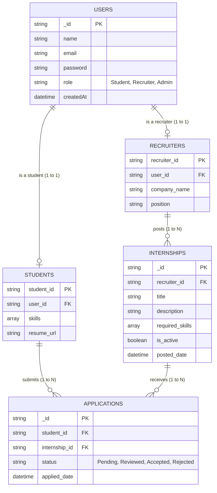

# ER Diagram

```mermaid
erDiagram
    USERS {
        string _id PK
        string name
        string email
        string password
        string role "Student, Recruiter, Admin"
        datetime createdAt
    }
    
    STUDENTS {
        string student_id PK
        string user_id FK
        array skills
        string resume_url
    }
    
    RECRUITERS {
        string recruiter_id PK
        string user_id FK
        string company_name
        string position
    }
    
    INTERNSHIPS {
        string _id PK
        string recruiter_id FK
        string title
        string description
        array required_skills
        boolean is_active
        datetime posted_date
    }
    
    APPLICATIONS {
        string _id PK
        string student_id FK
        string internship_id FK
        string status "Pending, Reviewed, Accepted, Rejected"
        datetime applied_date
    }

    %% Relationships (Cardinalities)
    USERS ||--o| STUDENTS : "is a student (1 to 1)"
    USERS ||--o| RECRUITERS : "is a recruiter (1 to 1)"
    
    RECRUITERS ||--o{ INTERNSHIPS : "posts (1 to N)"
    STUDENTS ||--o{ APPLICATIONS : "submits (1 to N)"
    INTERNSHIPS ||--o{ APPLICATIONS : "receives (1 to N)"
```
