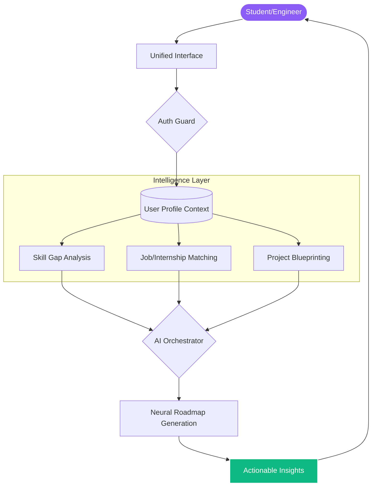

<div align="center">

<br />

# 🌌 SkillSync.ai
### The Operating System for Modern Engineering Careers

**Bridging the gap between academic learning and industry mastery through high-fidelity insights and strategic execution.**

<p align="center">
  
  
  
</p>

[**Explore Platform**](https://skillsync-ai-d4m8.vercel.app) • [**View Vision**](#-the-vision) • [**System Architecture**](#-neural-engine) • [**Contribute**](https://github.com/singhankit001/skillsync-ai/issues)

---

<p align="center">
  
  <br />
  <em>Real-time Skill Gap Analysis & AI Career Mentorship Dashboard</em>
</p>

</div>

---

## 💎 The Vision

Most students struggle with the **"Cold Start" problem**: knowing *what* to build, *what* to learn, and *how* to prove it. SkillSync.ai is a data-driven co-pilot that treats your career as a strategic engineering project. We consolidate market intelligence, skill assessment, and personalized mentorship into a single, high-fidelity workspace.

Instead of generic advice, we provide **actionable blueprints**.

---

## 🚀 Neural Engine Modules

SkillSync.ai is composed of several high-performance modules that work in tandem to optimize your professional trajectory.

<div align="center">
<table width="100%">
  <tr>
    <td width="50%">
      <h4>🔍 Gap Intelligence</h4>
      <p>Real-time mapping of your current arsenal against industry-specific demand. We identify exactly which libraries, patterns, and soft skills are missing from your profile.</p>
    </td>
    <td width="50%">
      <h4>🎯 Roadmap Synthesis</h4>
      <p>Dynamic 30/60/90 day execution plans that evolve as you learn. No more tutorial hell—just a structured path to mastery.</p>
    </td>
  </tr>
  <tr>
    <td width="50%">
      <h4>🛠️ Project Blueprints</h4>
      <p>AI-generated technical requirements for high-value projects. We give you the "what" and "why," and you build the "how."</p>
    </td>
    <td width="50%">
      <h4>📑 Resume Architect</h4>
      <p>Neural keyword optimization and impact analysis for ATS systems. Ensure your work actually gets seen by human recruiters.</p>
    </td>
  </tr>
</table>
</div>

---

## 🏗️ Neural Engine Flow

Our architecture is designed to handle complex career contexts and deliver low-latency, high-precision recommendations.



---

## 🛠️ Engineering Stack

We prioritized performance, type safety, and cinematic UI/UX.

- **Frontend Core**: [Next.js 15](https://nextjs.org/) (App Router), [TypeScript](https://www.typescriptlang.org/), [React 19](https://react.dev/)
- **Visual Design**: [Tailwind CSS](https://tailwindcss.com/) for tokens, [Framer Motion](https://www.framer.com/motion/) for fluid interactions
- **State Management**: [Zustand](https://zustand-demo.pmnd.rs/) / React Context (depending on complexity)
- **Deployment**: [Vercel](https://vercel.com/) with Edge caching and fast global delivery

---

## 📦 Quick Start for Developers

### **Configuration**
Define your production or local environment variables in `.env.local`:

```txt
NEXT_PUBLIC_API_URL=https://api.skillsync.ai/v1
```

### **Local Setup**
```bash
# Clone the repository
git clone https://github.com/singhankit001/skillsync-ai.git

# Install dependencies with optimized lockfile
pnpm install

# Start the development engine
pnpm dev
```

---

<div align="center">

### Built for the next generation of world-class engineers.

[**Follow Development**](#) • [**Join Discord**](#) • [**Support Platform**](#)

<sub>&copy; 2026 SkillSync.ai Platform. All rights reserved.</sub>

</div>
