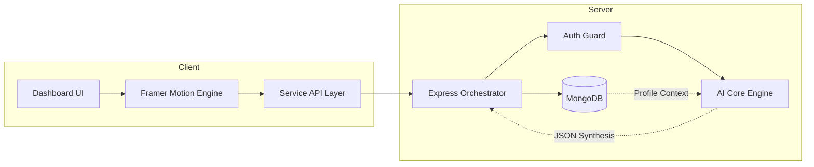

<div align="center">


# 🌌 CareerOS
### The AI Operating System for Modern Engineering Careers

[](https://github.com/your-username/careeros)
[](https://nextjs.org/)
[](https://nodejs.org/)
[](https://github.com/your-username/careeros)
[](https://github.com/your-username/careeros/blob/main/LICENSE)

**Architecting the path from student to elite engineer with context-aware AI.**

[Explore Demo](#) • [View Roadmap](#neural-roadmaps) • [Documentation](#-api-architecture) • [Report Bug](https://github.com/your-username/careeros/issues)

</div>

---

## 💎 The Premium Experience

CareerOS is a high-fidelity ecosystem that replaces fragmented career tools with a unified, cinematic interface. Designed for $100B-tier startup aesthetics and production-grade reliability.

<details open>
<summary><b>🚀 Core Intelligence Modules</b> (Click to collapse)</summary>

<br />

<div align="center">
<table width="100%">
  <tr>
    <td width="33%" align="center">
      <br />
      <b>Intent-Aware Coach</b><br />
      Context-aware mentor that understands your entire profile.
    </td>
    <td width="33%" align="center">
      <br />
      <b>Strategic Execution</b><br />
      AI-generated 30/60/90 day plans tailored to your pace.
    </td>
    <td width="33%" align="center">
      <br />
      <b>ATS Optimization</b><br />
      Role-specific keyword targeting and impact analysis.
    </td>
  </tr>
  <tr>
    <td width="33%" align="center">
      <br />
      <b>Gap Analysis</b><br />
      Real-time market mapping to identify your next best skill.
    </td>
    <td width="33%" align="center">
      <br />
      <b>Job Discovery</b><br />
      See exactly why you fit a role and how to bridge the gap.
    </td>
    <td width="33%" align="center">
      <br />
      <b>Resume Builders</b><br />
      High-value project ideas with full tech-stack blueprints.
    </td>
  </tr>
</table>
</div>

</details>

---

## 🛠️ The Tech Stack

Crafted with the most modern and performant technologies in the ecosystem.

<p align="center">
  
</p>

- **Frontend:** Next.js 14 (App Router), Framer Motion, Vanilla CSS (Design Tokens)
- **Backend:** Node.js (Express), Mongoose (ODM)
- **Intelligence:** OpenAI/LLM Orchestration, Intent-Based Routing
- **Security:** Stateless JWT Authentication, Sanitized API Layers

---

## 🏗️ System Design

> "Simplicity is the ultimate sophistication." — CareerOS Architecture



---

## 📡 API Architecture

<details>
<summary><b>📂 View Technical API Endpoints</b></summary>

<br />

| Category | Endpoint | Method | Response |
| :--- | :--- | :--- | :--- |
| **Identity** | `/api/auth/register` | `POST` | `JWT_TOKEN` |
| **Intelligence** | `/api/career/analyze` | `GET` | `CAREER_SCORE_DATA` |
| **Strategy** | `/api/roadmap/generate` | `POST` | `NEURAL_ROADMAP_JSON` |
| **Analysis** | `/api/resume/analyze` | `POST` | `ATS_INSIGHTS` |
| **Mentorship** | `/api/chat/message` | `POST` | `INTENT_AWARE_REPLY` |

</details>

---

## 🛣️ Neural Roadmaps

CareerOS visualizes your path as a dynamic neural sequence.

```text
[PHASE 1: Foundation] ----( 30 Days )----> [PHASE 2: Project Build] ----( 60 Days )----> [PHASE 3: Role Mastery]
      |                                           |                                           |
      v                                           v                                           v
   Skill Gaps Identified                   Blueprint Execution                       Mock Interviews
   Resume Scored                           Architecture Design                       Job Matching
```

---

## 📦 Quick Start

<details>
<summary><b>🛠️ Installation Guide</b></summary>

1. **Clone the repository**
   ```bash
   git clone https://github.com/your-username/careeros.git
   ```

2. **Install Dependencies**
   ```bash
   npm install
   ```

3. **Environment Setup**
   ```bash
   # .env
   PORT=5000
   MONGO_URI=your_uri
   JWT_SECRET=your_secret
   AI_API_KEY=your_key
   ```

4. **Launch Application**
   ```bash
   npm run dev
   ```

</details>

---

## 🎓 SESD Excellence Checklist

- [x] **Cinematic UI/UX:** HSL-based semantic tokens with zero banding.
- [x] **Elite AI Integration:** Intent-aware mentor with structured synthesis.
- [x] **Full-Stack Robustness:** Error-resilient Node.js/Express architecture.
- [x] **Scalable Design:** Stateless authentication and modular service layers.
- [x] **Documentation:** Production-grade technical and product vision files.

---

<div align="center">

### Built for the next generation of engineers.

[Follow on Twitter](#) • [Join Discord](#) • [Support CareerOS](#)

<sub>&copy; 2026 CareerOS AI Platform. All rights reserved.</sub>

</div>
