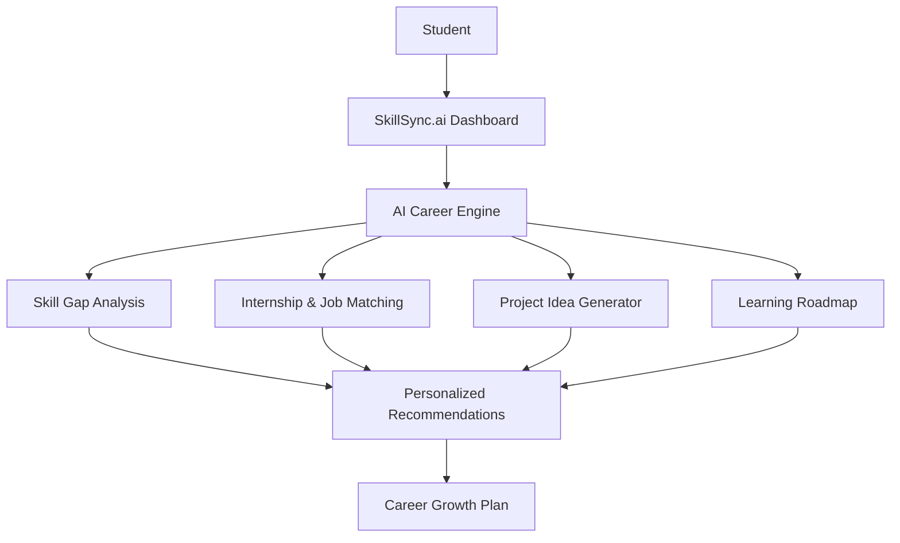

<div align="center">


# 🌌 SkillSync.ai
### Your AI Operating System for Skills, Projects, Internships & Career Growth

**A precision-engineered career platform helping students bridge the gap between education and high-impact industry roles through intelligent guidance.**

[](https://nextjs.org/)
[](https://www.typescriptlang.org/)
[](https://tailwindcss.com/)
[](https://vercel.com/)
<br />
[](https://github.com/singhankit001/skillsync-ai/stargazers)
[](https://github.com/singhankit001/skillsync-ai/network/members)
[](https://github.com/singhankit001/skillsync-ai/blob/main/LICENSE)

[**Live Demo**](https://skillsync-ai-d4m8.vercel.app) • [**Repository**](https://github.com/singhankit001/skillsync-ai) • [**Documentation**](#-system-architecture) • [**Report Bug**](https://github.com/singhankit001/skillsync-ai/issues)

</div>

---

<p align="center">
  <!-- Replace this with your real project screenshot or demo GIF. -->
  
</p>

## 💎 Product Overview

SkillSync.ai is a comprehensive AI ecosystem designed to navigate the complexities of the modern technical landscape. Instead of searching through fragmented resources, students gain access to a unified workspace that analyzes their unique profile to deliver high-fidelity career paths.

- **Strategic Career Discovery**: Data-driven matching for internships and full-time roles.
- **Intelligent Gap Analysis**: Real-time identification of missing technical and soft skills.
- **Dynamic Learning Roadmaps**: Personalized 30/60/90 day execution plans.
- **Project Blueprinting**: AI-generated project ideas with full technical implementation guides.
- **ATS-Ready Optimization**: Neural analysis of resumes and professional profiles.
- **Interview Intelligence**: Context-aware preparation modules for technical and behavioral rounds.

---

## 🎯 Why SkillSync.ai?

The transition from academia to industry is often obscured by a "cold start" problem. Students frequently find themselves asking:
- *Which skills actually matter in the current market?*
- *Which projects will differentiate my portfolio?*
- *How do I prepare for a role I haven't held yet?*

SkillSync.ai solves this by consolidating market intelligence, skill assessment, and personalized mentorship into a single, high-fidelity experience. We transform ambiguous career paths into clear, executable roadmaps.

---

## 🚀 Key Features

| Feature | Description | Status |
| :--- | :--- | :--- |
| **AI Career Dashboard** | A centralized hub for all career metrics and insights. | ✅ Live |
| **Internship & Job Discovery** | Intent-aware matching with major tech company openings. | ✅ Live |
| **Skill Gap Analyzer** | Deep-dive analysis of your current stack vs industry requirements. | ✅ Live |
| **Personalized Roadmaps** | Dynamic, time-bound learning sequences with curated resources. | ✅ Live |
| **AI Project Generator** | Unique project blueprints based on your career goals. | ✅ Live |
| **Resume Architect** | Neural keyword optimization and impact analysis. | ✅ Live |
| **Interview Mentor** | Context-aware technical and behavioral prep sessions. | ✅ Live |
| **Progress Tracking** | Visual analytics to monitor your growth over time. | ✅ Live |
| **Deployment Engine** | Full production-ready configuration for Vercel. | ✅ Live |

---

## 🛠️ Technical Architecture

SkillSync.ai is built on a modern, modular stack designed for scalability and performance.

### **Frontend Infrastructure**
- **Framework**: [Next.js 15+](https://nextjs.org/) (App Router)
- **State & Logic**: [React](https://reactjs.org/) + [TypeScript](https://www.typescriptlang.org/)
- **Styling**: [Tailwind CSS](https://tailwindcss.com/)
- **Motion**: [Framer Motion](https://www.framer.com/motion/)

### **AI & Intelligence Layer**
- **Orchestration**: LLM-native recommendation engine.
- **Context Handling**: Intent-based routing for personalized insights.
- **API Strategy**: Stateless, secure communication layers.

### **Deployment & DevOps**
- **Platform**: [Vercel](https://vercel.com/)
- **CI/CD**: GitHub Actions-ready.
- **Runtime**: Node.js Production Environment.

---

## 🏗️ System Flow



---

## 📦 Getting Started

### **Environment Setup**
Ensure you have the required environment variables configured in your `.env.local` or Vercel dashboard:

```txt
NEXT_PUBLIC_API_URL=https://your-api-endpoint.com/api
```

### **Installation**
```bash
# Clone the repository
git clone https://github.com/singhankit001/skillsync-ai.git

# Install dependencies
pnpm install

# Start the development server
pnpm dev
```

---

<div align="center">

### Built for the next generation of world-class engineers.

[**Follow Development**](#) • [**Join Discord**](#) • [**Support Platform**](#)

<sub>&copy; 2026 SkillSync.ai Platform. All rights reserved.</sub>

</div>
