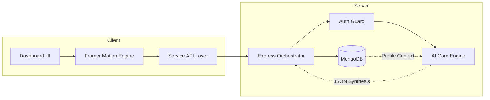

<div align="center">


# 🌌 SkillSync.ai
### A unified operating system for your engineering career growth.

[](https://github.com/your-username/skillsync-ai)
[](https://nextjs.org/)
[](https://github.com/your-username/skillsync-ai)

**Stop juggling fragmented job boards and resume builders. Start building your career with a data-driven AI co-pilot.**

[Explore Demo](#) • [View Roadmap](#neural-roadmaps) • [Documentation](#-api-architecture) • [Report Bug](https://github.com/your-username/skillsync-ai/issues)

</div>

---

## 💎 The Experience

SkillSync.ai isn't just another career tool. It’s a high-fidelity ecosystem designed to bridge the gap between being a student and becoming an elite engineer. We’ve combined world-class design with context-aware AI to create a seamless path for your professional growth.

<details open>
<summary><b>🚀 Intelligence Modules</b> (Click to collapse)</summary>

<br />

<div align="center">
<table width="100%">
  <tr>
    <td width="33%" align="center">
      <br />
      <b>Smart Career Coach</b><br />
      A mentor that actually knows your skills and where you want to go.
    </td>
    <td width="33%" align="center">
      <br />
      <b>Actionable Roadmaps</b><br />
      Personalized 30/60/90 day plans that evolve as you learn.
    </td>
    <td width="33%" align="center">
      <br />
      <b>ATS Optimizer</b><br />
      Impact analysis and role-specific keyword targeting for your resume.
    </td>
  </tr>
  <tr>
    <td width="33%" align="center">
      <br />
      <b>Market Gap Analysis</b><br />
      Real-time mapping of your current arsenal against industry demand.
    </td>
    <td width="33%" align="center">
      <br />
      <b>Smart Job Matching</b><br />
      See exactly why you're a fit for a role and what you're missing.
    </td>
    <td width="33%" align="center">
      <br />
      <b>Portfolio Builders</b><br />
      High-value project ideas with step-by-step technical blueprints.
    </td>
  </tr>
</table>
</div>

</details>

---

## 🛠️ The Tech Stack

Crafted with the most modern and performant technologies in the ecosystem.

<p align="center">
  
</p>

- **Frontend:** Next.js 15 (App Router), Framer Motion, Vanilla CSS
- **Backend:** Node.js (Express), Mongoose (ODM)
- **Intelligence:** LLM Orchestration & Intent Analysis
- **Security:** Stateless JWT Authentication & Sanitized API Layers

---

## 🏗️ System Design

> "Simplicity is the ultimate sophistication." — SkillSync.ai Architecture



---

## 🚀 Deployment

SkillSync.ai is optimized for zero-config deployment on **Vercel**.

### ☁️ Vercel Deployment Steps

1. **Push to GitHub**: Ensure all changes are committed and pushed.
2. **Import Project**: Go to [Vercel Dashboard](https://vercel.com/new) and import the repository.
3. **Environment Variables**: Add the following in the Vercel project settings:
   - `NEXT_PUBLIC_API_URL`: Your backend URL (e.g., `https://api.skillsync.ai/api`)
4. **Deploy**: Click "Deploy". Vercel will auto-detect the Next.js framework.

---

## 📦 Quick Start

<details>
<summary><b>🛠️ Installation Guide</b></summary>

1. **Clone the repository**
   ```bash
   git clone https://github.com/your-username/skillsync-ai.git
   ```

2. **Install Dependencies**
   ```bash
   npm install
   ```

3. **Launch Application**
   ```bash
   npm run dev
   ```

</details>

---

<div align="center">

### Built for the next generation of engineers.

[Follow on Twitter](#) • [Join Discord](#) • [Support SkillSync.ai](#)

<sub>&copy; 2026 SkillSync.ai AI Platform. All rights reserved.</sub>

</div>
