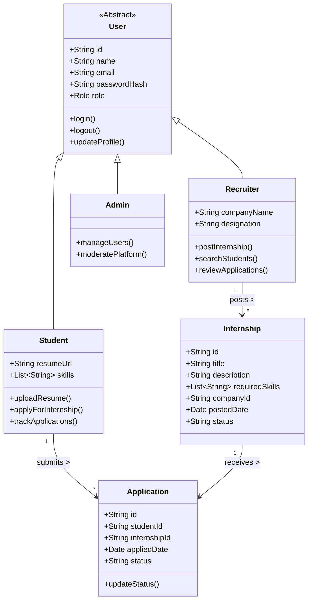

# Class Diagram

```mermaid
classDiagram
    %% Core Users
    class User {
        <<Abstract>>
        +String id
        +String name
        +String email
        +String passwordHash
        +Role role
        +login()
        +logout()
        +updateProfile()
    }

    class Student {
        +String resumeUrl
        +List~String~ skills
        +uploadResume()
        +applyForInternship()
        +trackApplications()
    }

    class Recruiter {
        +String companyName
        +String designation
        +postInternship()
        +searchStudents()
        +reviewApplications()
    }

    class Admin {
        +manageUsers()
        +moderatePlatform()
    }

    %% Core Entities
    class Internship {
        +String id
        +String title
        +String description
        +List~String~ requiredSkills
        +String companyId
        +Date postedDate
        +String status
    }

    class Application {
        +String id
        +String studentId
        +String internshipId
        +Date appliedDate
        +String status
        +updateStatus()
    }

    %% Relationships illustrating OOP Concepts
    %% Inheritance
    User <|-- Student
    User <|-- Recruiter
    User <|-- Admin
    
    %% Associations (Composition/Aggregation relationships)
    Student "1" --> "*" Application : submits >
    Internship "1" --> "*" Application : receives >
    Recruiter "1" --> "*" Internship : posts >
```
