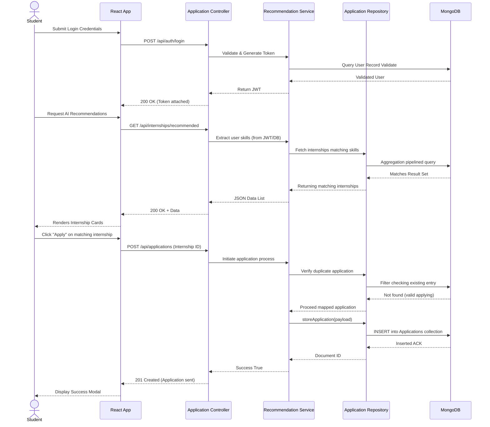

# Sequence Diagram

```mermaid
sequenceDiagram
    actor Student
    participant Frontend as React App
    participant Controller as Application Controller
    participant Service as Recommendation Service
    participant Repo as Application Repository
    participant DB as MongoDB

    %% Login Workflow
    Student->>Frontend: Submit Login Credentials
    Frontend->>Controller: POST /api/auth/login
    Controller->>Service: Validate & Generate Token
    Service->>DB: Query User Record Validate
    DB-->>Service: Validated User
    Service-->>Controller: Return JWT
    Controller-->>Frontend: 200 OK (Token attached)

    %% Browse / Recommendations
    Student->>Frontend: Request AI Recommendations
    Frontend->>Controller: GET /api/internships/recommended
    Controller->>Service: Extract user skills (from JWT/DB)
    Service->>Repo: Fetch internships matching skills
    Repo->>DB: Aggregation pipelined query
    DB-->>Repo: Matches Result Set
    Repo-->>Service: Returning matching internships
    Service-->>Controller: JSON Data List
    Controller-->>Frontend: 200 OK + Data
    Frontend-->>Student: Renders Internship Cards

    %% Application Workflow
    Student->>Frontend: Click "Apply" on matching internship
    Frontend->>Controller: POST /api/applications (Internship ID)
    Controller->>Service: Initiate application process
    Service->>Repo: Verify duplicate application
    Repo->>DB: Filter checking existing entry
    DB-->>Repo: Not found (valid applying)
    Repo-->>Service: Proceed mapped application
    Service->>Repo: storeApplication(payload)
    Repo->>DB: INSERT into Applications collection
    DB-->>Repo: Inserted ACK
    Repo-->>Service: Document ID
    Service-->>Controller: Success True
    Controller-->>Frontend: 201 Created (Application sent)
    Frontend-->>Student: Display Success Modal
```
