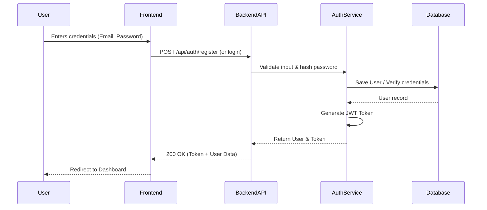
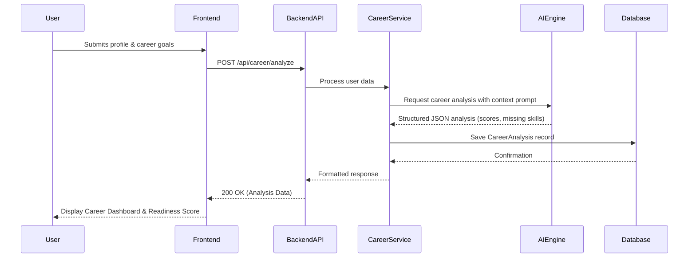
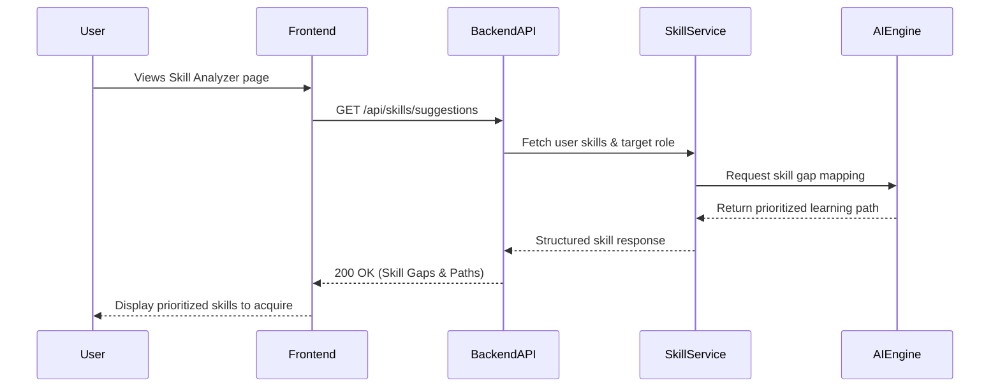
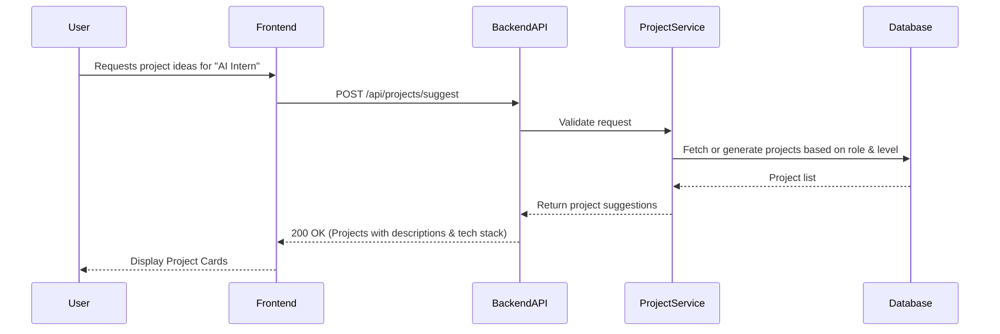
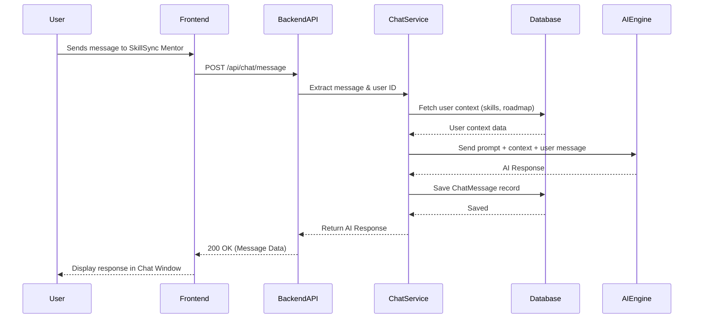
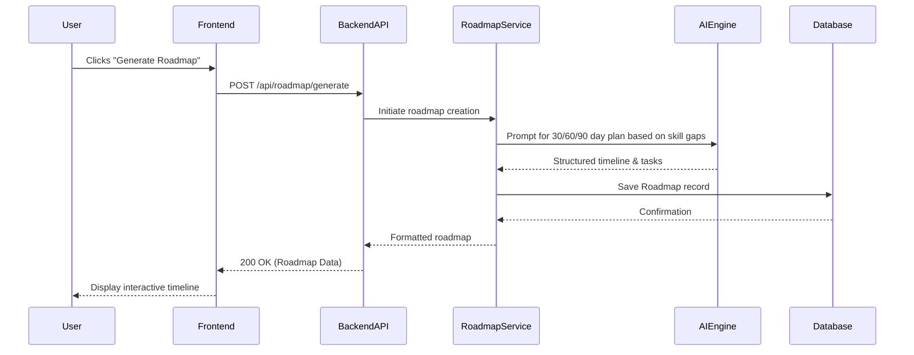
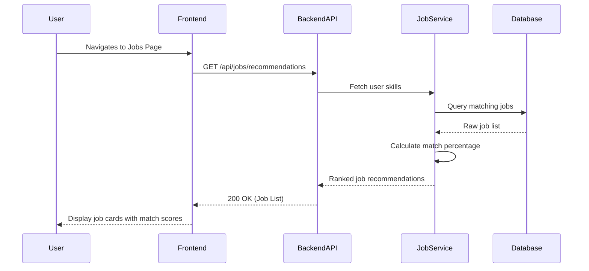
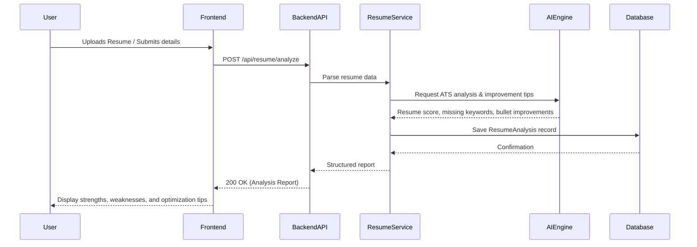

# SkillSync.ai - Sequence Diagrams

This document outlines the core data flows and interactions within the SkillSync.ai platform using Mermaid sequence diagrams.

## 1. User Registration / Login Flow

## 2. Career Analysis Flow

## 3. Skill Gap Analysis Flow

## 4. Project Suggestion Flow

## 5. AI Chatbot Flow

## 6. Roadmap Generation Flow

## 7. Job Recommendation Flow

## 8. Resume Analysis Flow

