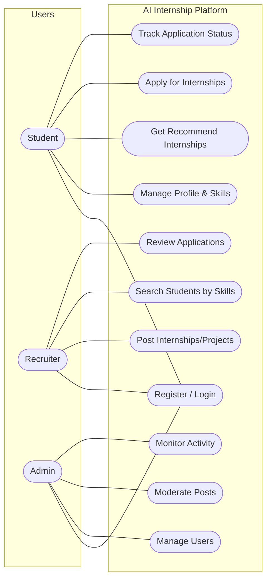

# Use Case Diagram

```mermaid
flowchart LR
    %% Actors
    subgraph Users
        Student([Student])
        Recruiter([Recruiter])
        Admin([Admin])
    end

    %% System
    subgraph "AI Internship Platform"
        UC1([Register / Login])
        UC2([Manage Profile & Skills])
        UC3([Get Recommend Internships])
        UC4([Apply for Internships])
        UC5([Track Application Status])
        
        UC6([Post Internships/Projects])
        UC7([Search Students by Skills])
        UC8([Review Applications])
        
        UC9([Manage Users])
        UC10([Moderate Posts])
        UC11([Monitor Activity])
    end

    %% Student Relationships
    Student --- UC1
    Student --- UC2
    Student --- UC3
    Student --- UC4
    Student --- UC5

    %% Recruiter Relationships
    Recruiter --- UC1
    Recruiter --- UC6
    Recruiter --- UC7
    Recruiter --- UC8

    %% Admin Relationships
    Admin --- UC1
    Admin --- UC9
    Admin --- UC10
    Admin --- UC11
```
